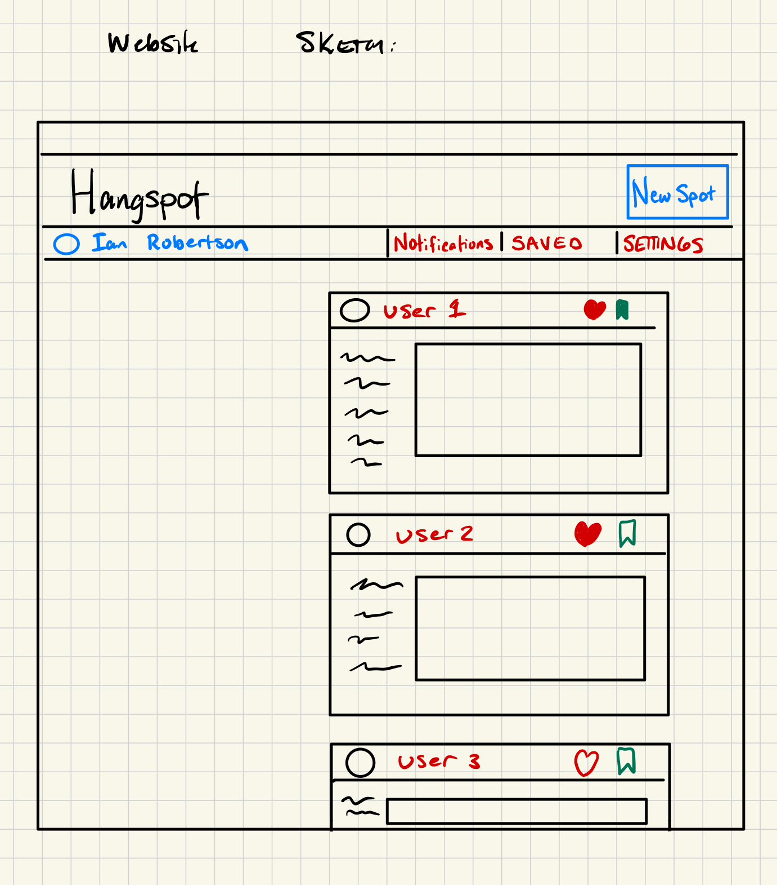

# startup
Startup Application for BYU CS 260

[notes.md file](notes.md)

# Specification

## Elevator Pitch
A web application that allows users to upload images and locations of hammock spots. A user can create a profile and create a hammock spot to upload to a content sharing page. Each spot includes a geo-location to allow other users to find it, images or videos of the the location, and a description of the spot. Users can save, like, and comment on other hammock spots. 

## Technologies
- **HTML** Login page. Hammock spot feed page. Create/upload spot page. Notification page that shows how others have interacted with your posts. Page for saved spots. 
- **CSS** Profressional, simple clean style. Model after outdoor brand websites such as REI, Patagonia websites. 
- **JavaScript** Login page, content creation page, pull to refresh content page. 
- **React** Content page will have componets for each content post in frames, new content loads as page is scrolled. 
- **Web Service**
  - createPost
  - getNewPosts
  - likePost
  - savePost
  - viewPostLocation: Insert geoLocation with https://openlayers.org/
- **Authentication**
  - All actions need to be authenticated with authToken
  - Users create and verify an account. Create a username that allows them to interact with others. 
- **Database** Login information securely stored. Created posts are stored and associated with accounts. Post interactions are stored and associated with users and posts. 
- **WebSocket** Notify users when other users interact with their posts. Such as saving a hammock spot or saving it.

## Sketchup

## HTML Deliverable 
Created skeleton of web app using several different pages. Included main, notifications, settings, create post and saved spots.
Including placeholder values for API and reactive components. Created links between pages on header. Basic log in page.
On Main page, created cards that represent basic Hammock spot posts, these include options to like, save, and bring up the location for the spots as well as a photo and a a description.

## CSS Deliverable 
Using Bootstrap styling on webpage. Created main.css file for styling and refactored some aspect of the page. 
Refactored header and created buttons. Brought everything onto one row in header. Changed order of links. 
Used accordion for Login input. 
Added styling for hammock cards. 
Styled table for saved spots. 
Added consistent footer throughout page with repo link. 
Tried to make design responsive but there are some possible improvements with header and footer. 

## React Deliverable
I followed the simon startup example to port my startup to react. 
I created components for each of the main pages, and added a router to allow access to all of them. 
I created a component for the basic hammock spot card that prevents code duplication. 
Added Hook in hammock spot component that shows difference when liking and unliking a post. 

## Service Deliverable
I created an index.js file and added endpoints. I create and allow for logging into the app
I created an endpoint that allows for creating a hammock spot, the location is selected using the google maps API
The data is sent back to the home page and the hammock spots are rendered for the user. 
I created a locationPicker and map components that integrate with google maps. Don't steal my API Key!
Instruction: Log in, go to create, make a post, make sure to click the map, go back to home, post will be there.

## Login Deliverable
I added a database.js file that contains all of the interface between the database and the backend. I mostly followed what was done in Simon example. 
I updated my index.js file to call these database functions instead of storing the information in the index.js file. 
For this deliverable I also made some updates to my gitignore to be sure my API keys and mongodb login was not accessible in github. 

## WebSocket Deliverable
In this deliverable, I added a live feed of notifications occuring when users create,like,or save hangspot posts. To see this in action, open two hangspot apps in different web browsers, look at the notification tab in one, then interact with the app in the other browser. Note, this doesn't work in the same browser because of cookies. I added a peerProxy file that allows for http connections to be upgraded to websocket connections when the server is connected to. I also implemented and integrated the liked, and saved features for posts. I added the saved posts tab to see these posts. 

